# SX Obsidian

[](https://github.com/Jax-Baiya/sx_obsidian/actions/workflows/ci.yml)


**Local-first media intelligence stack for Obsidian** — source-scoped backend, fast plugin UX, TUI control plane, and a new web control surface.

---

## Why this exists

Large media libraries (10k–50k+) can cripple vault responsiveness when represented as raw Markdown files.

SX Obsidian keeps your vault fast by storing the heavy dataset in the database layer while exposing a curated active set inside Obsidian.

---

## What we’ve achieved 🚀

- ✅ **Source-scoped architecture** (no cross-profile bleed)
- ✅ **FastAPI backend** with explicit source/profile guardrails
- ✅ **Modularized Obsidian plugin** with restored rich library interactions
- ✅ **TUI control plane** for API, import, DB, and settings workflows
- ✅ **Web control plane scaffold** for library/queue/schedule/settings surfaces
- ✅ **Expanded regression coverage + CI hardening**
- ✅ **Operational runbooks and recovery workflows**

---

## Architecture at a glance

- **Core backend (`sx_db/`)**
  - API + repository layer
  - source registry and profile-aware resolution
  - scheduler and recovery tooling
- **Obsidian plugin (`obsidian-plugin/`)**
  - SX Library table/search UX
  - note pin/sync flows
  - hover/note preview + metadata editing
- **TUI (`sx_db/tui/`)**
  - terminal-first operations and diagnostics
- **Web (`web/`)**
  - Next.js control plane scaffold
- **Docs (`docs/`)**
  - structured by architecture/developer/user/runbooks/governance

---

## Achievement showcase (from `docs/assets/showcase/`)

### Featured snapshots

| Milestone                        | Screenshot                                               |
| -------------------------------- | -------------------------------------------------------- |
| UI/Theme polish                  | 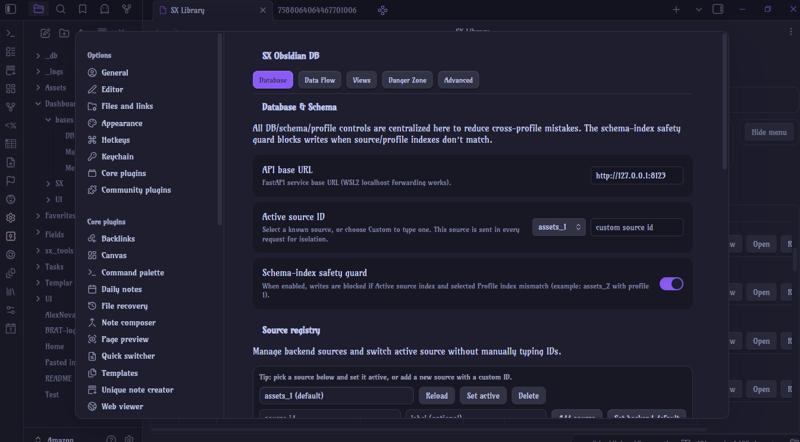 |
| Library interaction improvements | 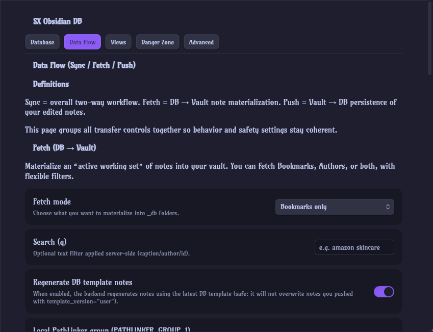 |
| Data/flow visual validation      | 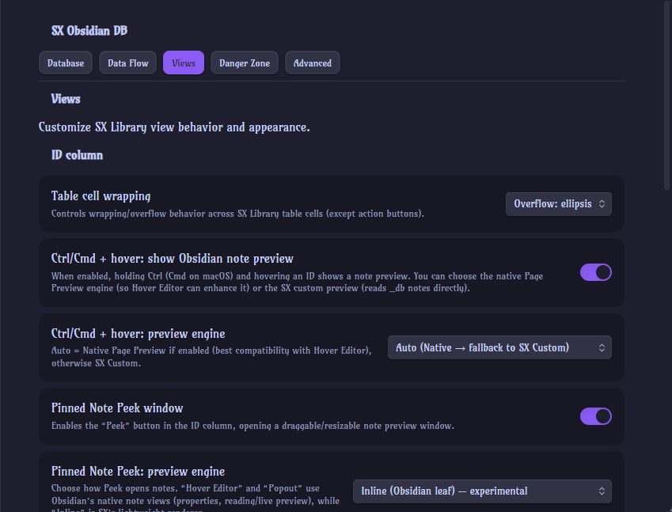 |
| Progress on advanced views       | 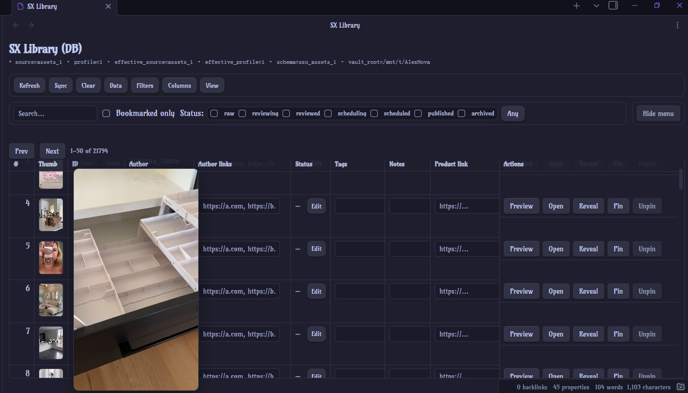 |
| Control-plane maturity           | 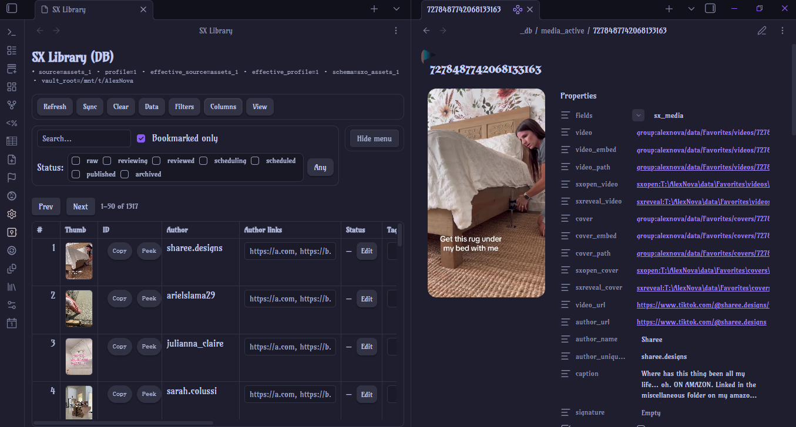 |
| Current achievement state        | 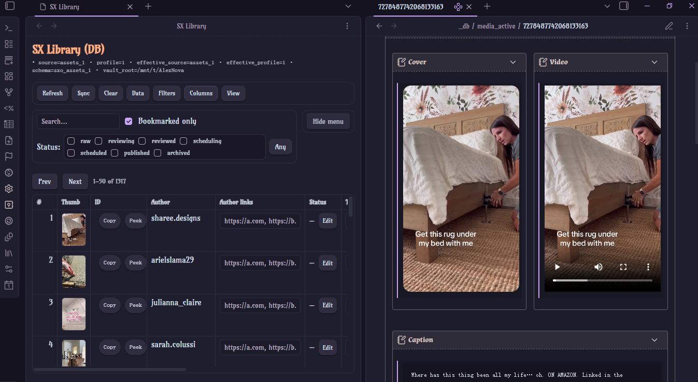 |

<details>
<summary><strong>Full gallery (all captured progress screenshots)</strong></summary>

- 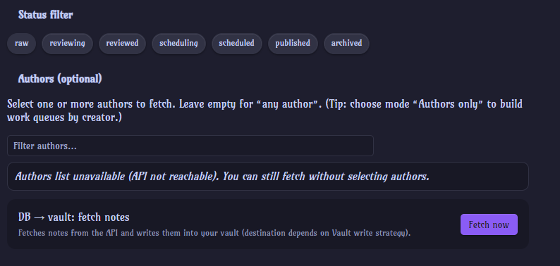
- 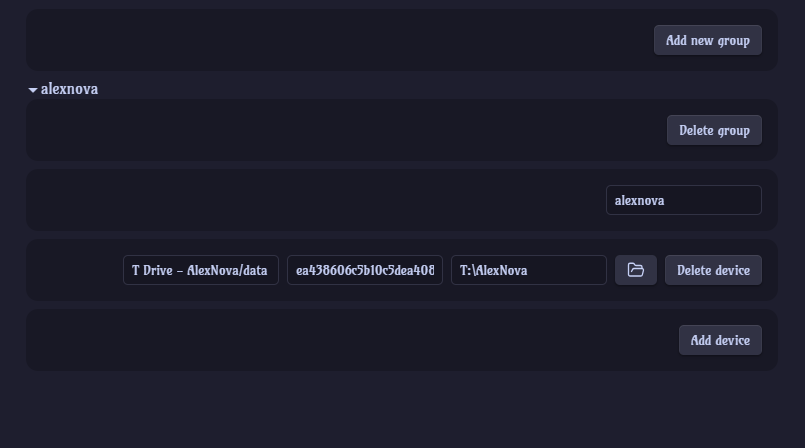
- 
- 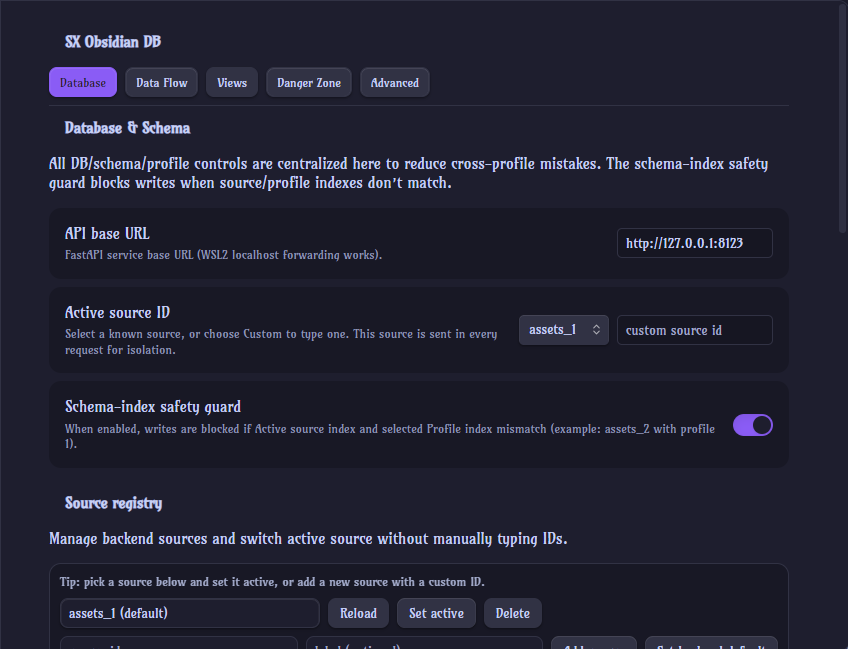
- 
- 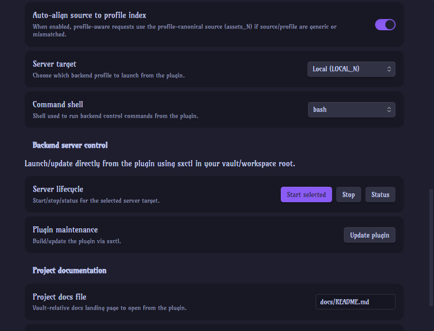
- 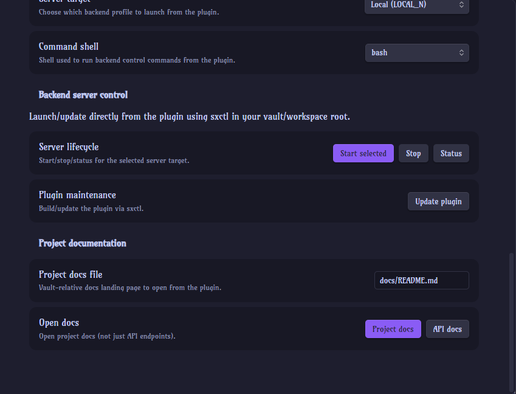
- 
- 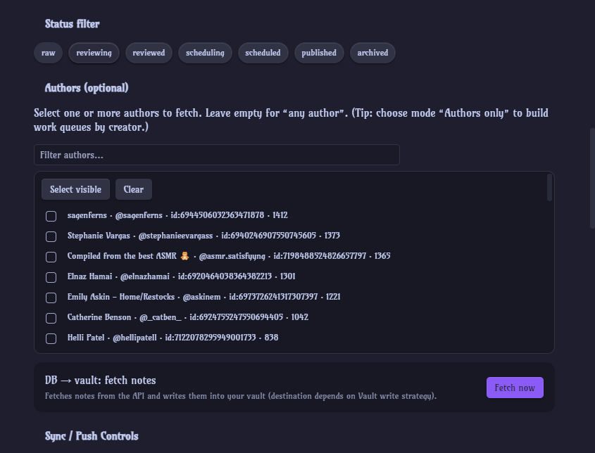
- 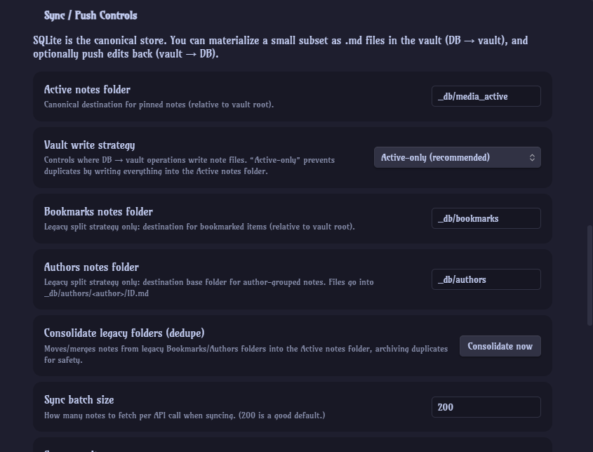
- 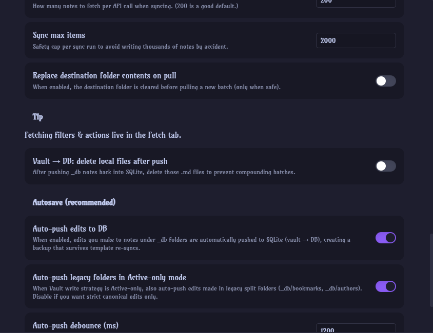
- 
- 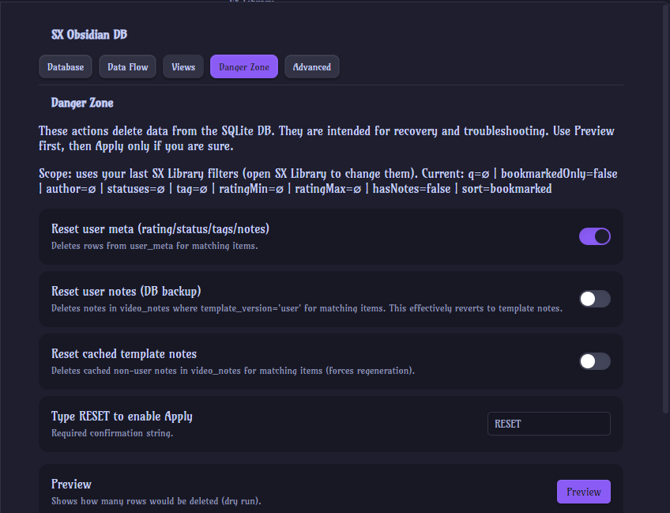
- 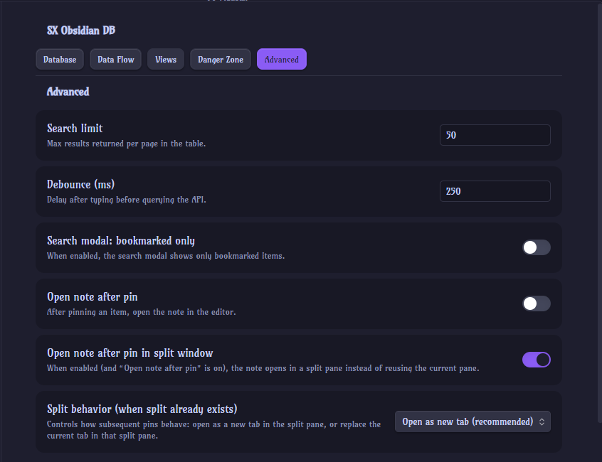
- 
- 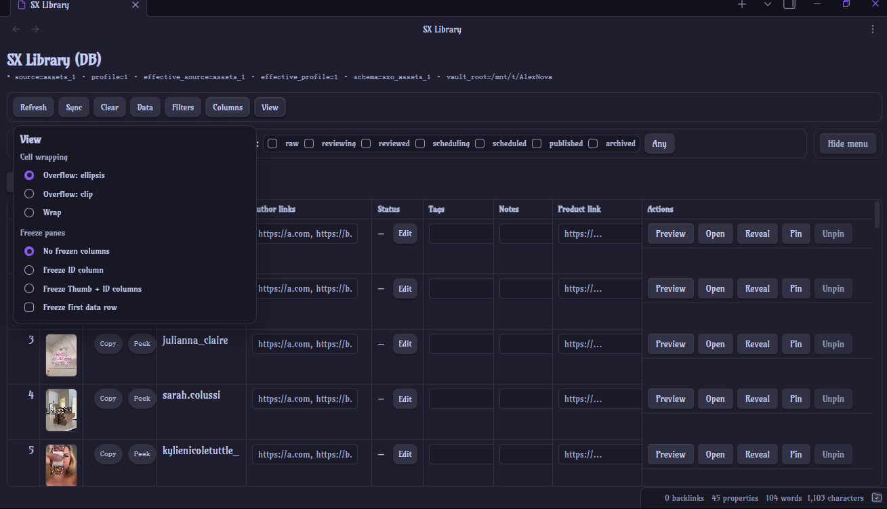
- 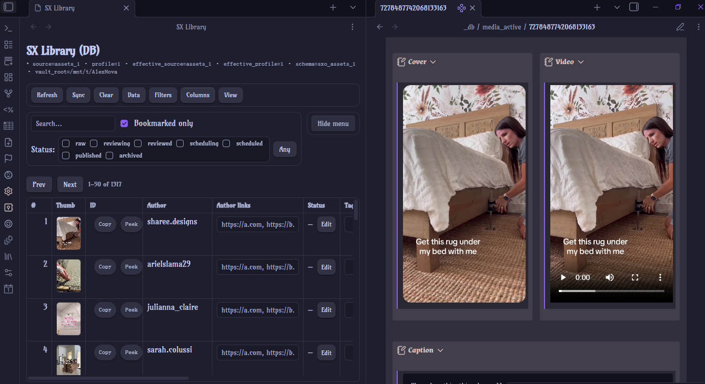
- 
- 

</details>

---

## Quickstart

Prefer a guided, OS-specific setup?

- Start here: [`docs/user/SETUP_AND_LAUNCH.md`](docs/user/SETUP_AND_LAUNCH.md)
- Includes Windows (WSL/native notes), Linux, and macOS launch workflows.

### 1) Bootstrap

```bash
make -f scripts/Makefile bootstrap
cp .env.example .env
```

### 2) Initialize and import

```bash
make -f scripts/Makefile api-init
make -f scripts/Makefile api-import
```

### 3) Run backend

```bash
make -f scripts/Makefile api-serve
```

Default: `http://127.0.0.1:8123`

### 4) Build/install plugin

```bash
export OBSIDIAN_VAULT_PATH=/path/to/your/vault
make -f scripts/Makefile plugin-build
make -f scripts/Makefile plugin-install
```

Or:

```bash
./scripts/sxctl.sh plugin update
```

### 5) (Optional) Run web control plane

```bash
cd web
npm install
npm run dev
```

---

## Documentation map

Start with: [`docs/INDEX.md`](docs/INDEX.md)

- Architecture: [`docs/architecture/`](docs/architecture)
- Developer docs: [`docs/developer/`](docs/developer)
- User docs: [`docs/user/`](docs/user)
- Runbooks: [`docs/runbooks/`](docs/runbooks)
- Governance: [`docs/governance/`](docs/governance)

---

## Developer workflows

- Plugin build: `cd obsidian-plugin && npm run build`
- Focused test pass: `./.venv/bin/python -m pytest -q tests/test_sources_api.py tests/test_tui_api_control.py`
- Full tests: `make -f scripts/Makefile test`

---

## Security & operational notes

- Keep API local (`127.0.0.1`) unless explicitly intended.
- Use explicit source/profile context for operational commands.
- Follow governance safety rails in [`docs/governance/GIT_WORKFLOW_SAFETY.md`](docs/governance/GIT_WORKFLOW_SAFETY.md).
